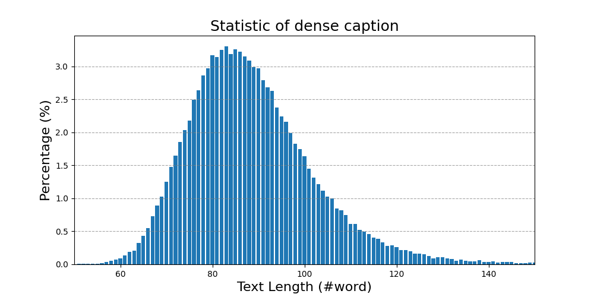
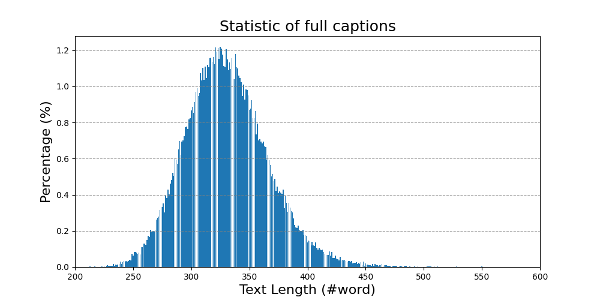
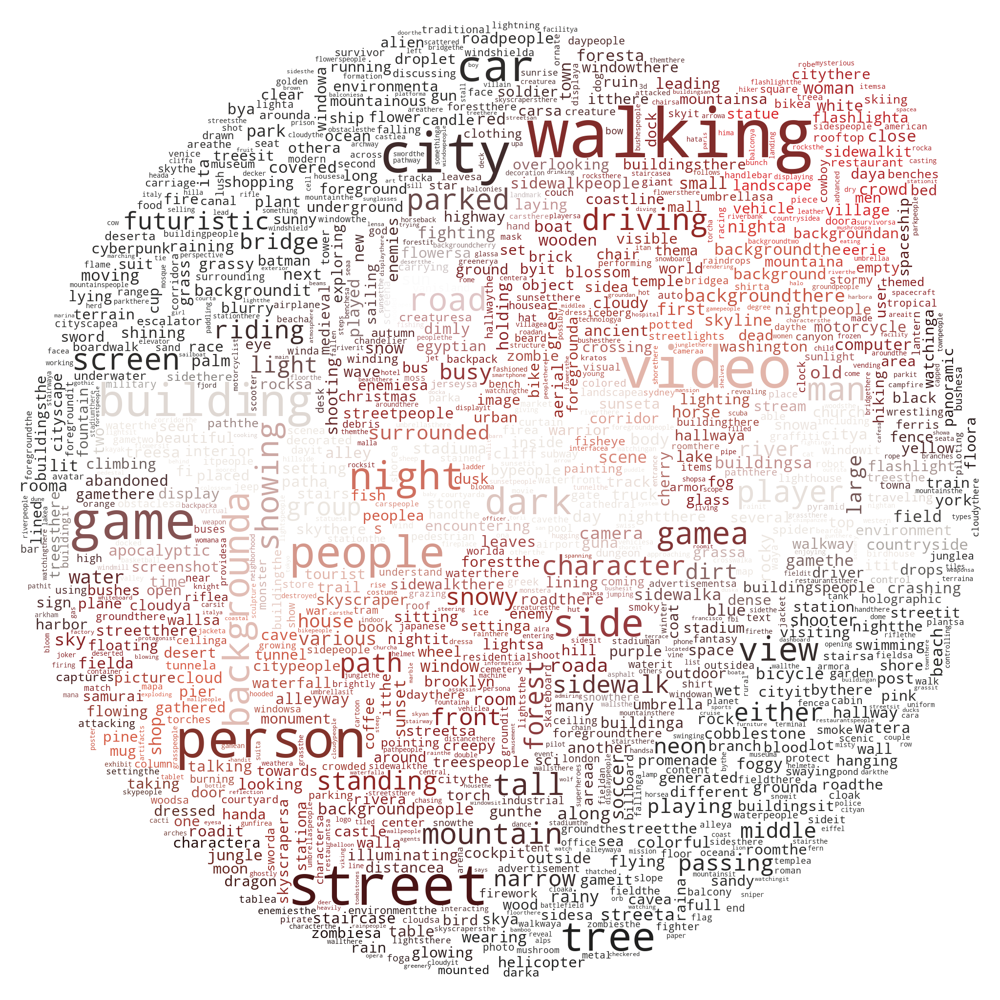
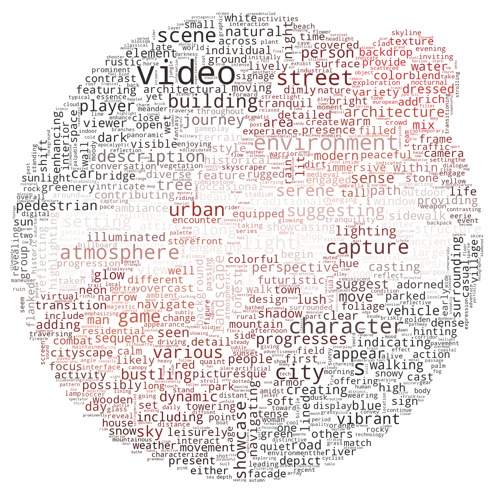

  

## MiraData:  A Large-Scale Video Dataset with Long Video Duration and Hierarchical Captions

<!--  -->

## Introduction

Video datasets play a crucial role in video generation such as [sora](https://openai.com/sora).
However, existing text-video datasets often fall short when it comes to **handling long video sequences** and **capturing shot transitions**.
To address these limitations, we introduce MiraData, a large-scale video dataset designed specifically for long video generation tasks.

#### **Key Features of MiraData**

1. **Long Video Duration**: Unlike previous datasets, where video clips are often very short (typically less than 6 seconds), MiraData focuses on uncut video segments with durations ranging from 1 to 2 minutes. This extended duration allows for more comprehensive modeling of video content.
2. **Hierarchical Captions**: Each video in MiraData is accompanied by hierarchical captions. These captions provide detailed descriptions from various perspectives, enhancing the richness of the dataset. The average caption length is 349 words, ensuring a thorough representation of the video content.

#### Current Status

In this initial release, MiraData includes two scenarios:

- Gaming: Videos related to gaming experiences.
- City/Scenic Exploration: Videos capturing urban or scenic views.

MiraData is still in its early stages, and we will release more scenarios and improve the quality of the dataset in the near future.

<h3 align='center'>Demo Video</h3>

## Dataset

### Meta Files

  <!-- | Split           | Download | # Source Videos | # Samples | Video Duration | Storage Space|
  |-----------------|----------|-----------------|-----------|----------------|--------------|
  | Training (full) | [link](https://drive.google.com/file/d/1DeODUcdJCEfnTjJywM-ObmrlVg-wsvwz/view?usp=sharing) (2.01 GB) | 3,779,763 | 70,723,513 | 167 khrs  | ~36 TB  |
  | Training (10M)  | [link](https://drive.google.com/file/d/1Lrsb65HTJ2hS7Iuy6iPCmjoc3abbEcAX/view?usp=sharing) (381 MB)  | 3,755,240 | 10,473,922 | 37.0 khrs | ~8.0 TB |
  | Training (2M)   | [link](https://drive.google.com/file/d/1jWTNGjb-hkKiPHXIbEA5CnFwjhA-Fq_Q/view?usp=sharing) (86.5 MB) | 800,000   | 2,400,000  | 7.56 khrs | ~1.6 TB |
  | Validation      | [link](https://drive.google.com/file/d/1cTCaC7oJ9ZMPSax6I4ZHvUT-lqxOktrX/view?usp=sharing) (803 KB)  | 2,000     | 6,000      | 18.5 hrs  | ~4.0 GB |
  | Testing         | [link](https://drive.google.com/file/d/1ee227tHEO-DT8AkX7y2q6-bfAtUL-yMI/view?usp=sharing) (803 KB)  | 2,000     | 6,000      | 18.5 hrs  | ~4.0 GB | -->

### How to Download

## Captions

#### Hierarchical Captions

Each video in MiraData is accompanied by hierarchical captions. These captions provide detailed descriptions from various perspectives, enhancing the richness of the dataset.

**Six Types of Captions**:

- Main Object Description: Describes the primary object or subject in the video.
- Background: Provides context about the environment or setting.
- Style: Covers artistic or visual aspects, such as xxx.
- Camera Movement: Details any camera pans, zooms, or other movements.
- Short Caption: A concise summary capturing the essence of the video, generated using the [Panda-70M](https://github.com/snap-research/Panda-70M/tree/main/captioning) caption model.
- Dense Caption: A more elaborate and detailed description that summarizes the above five types of captions.

#### Captions with GPT4V

We tested the existing open-source V-LLM methods and GPT-4V, and found that GPT-4V's captions show better accuracy and coherence in semantic understanding in terms of temporal sequence. It also provides more accurate descriptions of the main subject and background objects, with fewer object omissions and less hallucination issues. Therefore, we Therefore, we use GPT-4V to generate Dense Captions, Main Object Descriptions, Background Descriptions, Camera Movement Descriptions, and Video Styles. In order to balance annotation costs and caption accuracy, we uniformly sample 8 frames for each video and arrange them into a 2x4 grid of one large image. Then, we use the caption model of [Panda-70M](https://github.com/snap-research/Panda-70M/tree/main/captioning) to annotate each video with a one-sentence caption, which serves as a hint for the main content, and input it into our fine-tuned prompt. By feeding the fine-tuned prompt and a 2x4 large image to GPT-4V, we can efficiently and cost-effectively output captions for multiple dimensions in just one round of conversation. The specific prompt content can be found in the [prompt.py](prompt.py) file, and we welcome everyone to contribute to the more high-quality caption data or buy us a coffee to generate more captions. :raised_hands:

## Statistic 📝

     
    

 &nbsp;&nbsp;&nbsp;&nbsp; Total text length statistics of dense captions. &nbsp;&nbsp;&nbsp;&nbsp;&nbsp; Total text length statistics of six types of captions.

     
    

Word cloud of short captions. &nbsp;&nbsp;&nbsp;&nbsp;&nbsp;&nbsp;&nbsp;&nbsp;&nbsp;&nbsp;&nbsp;&nbsp;&nbsp;&nbsp;&nbsp; Word cloud of dense captions.

## Demonstration

### Video-Caption Pairs in MiraData

  <table class="center">
    <tr>
      <td width=33.3% style="border: none"></td>
      <td width=33.3% style="border: none"></td>
      <td width=33.3% style="border: none"></td>
    </tr>
    <tr style="text-align: center;">
      <td width=33.3% style="border: none">A man navigating through a series of urban environments in a video game. The character is dressed casually in a light-colored shirt and dark pants. He moves with a sense of urgency, suggesting a stealth or action-oriented gameplay scenario. The environments are detailed and realistic, with textures and lighting that give a sense of depth and immersion. The man interacts with the environment, climbing and jumping over obstacles, which indicates the game likely includes parkour or exploration elements. The presence of dialogue text suggests that there is a narrative component to the game, with other characters communicating with the man, possibly indicating cooperative gameplay or a story-driven mission.
</td>
      <td width=33.3% style="border: none">A person is holding a long haired dachshund in their arms.</td>
      <td width=33.3% style="border: none">A rocket launches into space on the launch pad.</td>
    </tr>
  </table>

  <table class="center">
    <tr>
      <td width=33.3% style="border: none"></td>
      <td width=33.3% style="border: none"></td>
      <td width=33.3% style="border: none"></td>
    </tr>
    <tr style="text-align: center;">
      <td width=33.3% style="border: none">A person is kneading dough and putting jam on it.</td>
      <td width=33.3% style="border: none">A little boy is playing with a basketball in the city.</td>
      <td width=33.3% style="border: none">A 3d rendering of a zoo with animals and a train.</td>
    </tr>
  </table>

  <table class="center">
    <tr>
      <td width=33.3% style="border: none"></td>
      <td width=33.3% style="border: none"></td>
      <td width=33.3% style="border: none"></td>
    </tr>
    <tr style="text-align: center;">
      <td width=33.3% style="border: none">A person in blue gloves is connecting an electrical supply to an injector.</td>
      <td width=33.3% style="border: none">There is a beach with waves and rocks in the foreground, and a city skyline in the background.</td>
      <td width=33.3% style="border: none">It is a rally car driving on a dirt road in the countryside, with people watching from the side of the road.</td>
    </tr>
  </table>

**We will remove the video samples from our dataset / Github / project webpage as long as you need it. Please [contact to us](#Contact-Information) for the request.

## License of MiraData

See [license](https://github.com/snap-research/Panda-70M/blob/main/LICENSE).
The video samples are collected from a publicly available dataset.
Users must follow [the related license](https://raw.githubusercontent.com/microsoft/XPretrain/main/hd-vila-100m/LICENSE) to use these video samples.

## Citation

If you find this project useful for your research, please cite our paper. :blush:

## Contact Information
